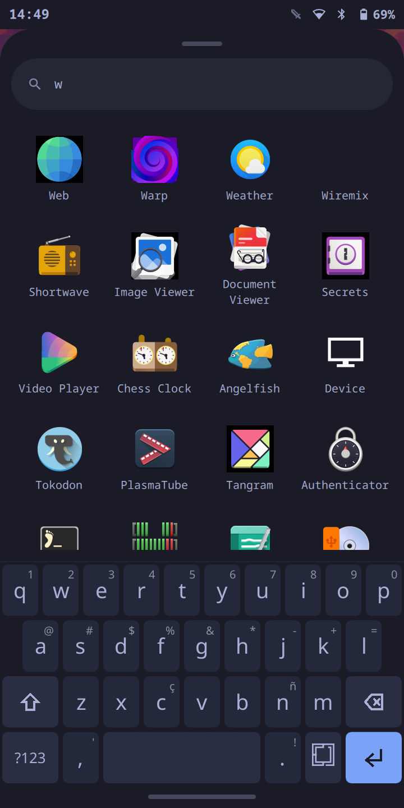
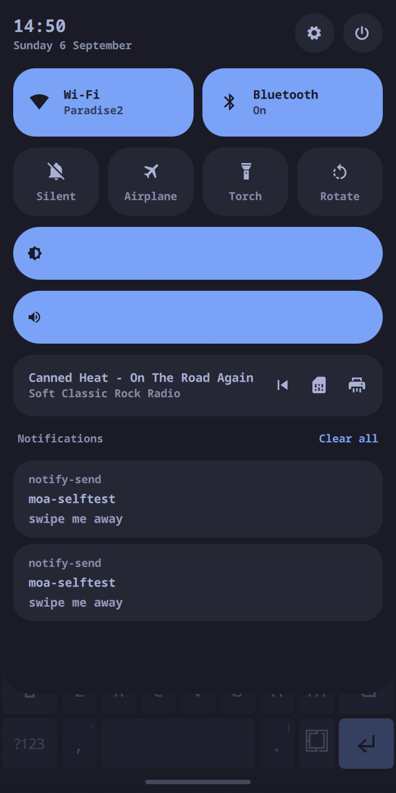
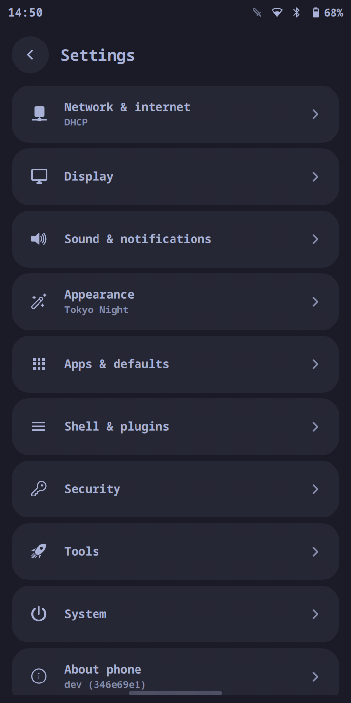
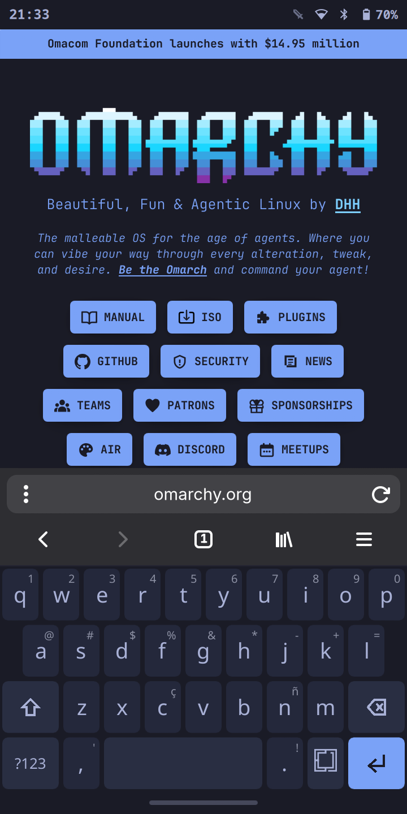
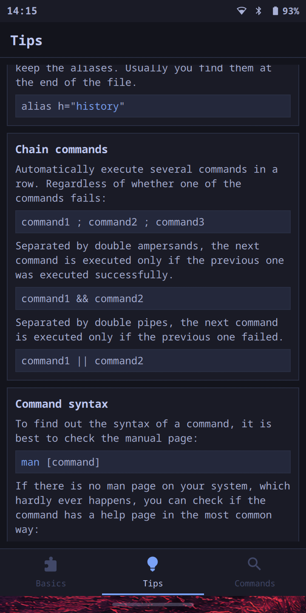

# moarchy

<p align="center">
  
  
  
  
  
</p>

Omarchy's look, keybindings and theming on an original **PinePhone**, running on
Arch Linux ARM (DanctNIX) with **Sway** in Hyprland's place.

This is not a fork of Omarchy's installer. It is a thin overlay that vendors
Omarchy's *configuration and theme layer* — which is architecture-neutral — onto
an aarch64 base, and replaces the one part that cannot work on this hardware.

## Why not just run Omarchy?

Two hard blockers, both verified rather than assumed.

**1. Hyprland cannot run on this GPU.** Hyprland's renderer includes
`<GLES3/gl32.h>` and aborts if it cannot get a GLES 3.x context:

```
src/render/OpenGL.cpp:215  WARN  "EGL: Failed to create a context with GLES3.2, retrying 3.0"
src/render/OpenGL.cpp:228  RASSERT(false, "EGL: failed to create a context with either GLES3.2 or 3.0")
```

The PinePhone's Allwinner A64 has a Mali-400 MP2 driven by Lima, which tops out
at **OpenGL ES 2.0**. That is a hardware limit, not a driver gap, and Hyprland
0.50 removed the legacy GLES2 renderer that would have been the last way around
it. Sway (wlroots, GLES2) runs fine.

*(A PinePhone **Pro** is a different story: its Mali-T860 does GLES 3.1 under
Panfrost, which clears Hyprland's floor. `install/preflight.sh` detects and says
so.)*

**2. Omarchy's package repo is x86_64-only.**

```
https://pkgs.omarchy.org/stable/x86_64/omarchy.db  ->  200  (211 packages)
https://pkgs.omarchy.org/stable/aarch64/omarchy.db ->  404
```

`install/preflight/guard.sh` upstream also requires x86_64, limine, a btrfs root
and vanilla-Arch markers — none of which hold on a PinePhone.

## What ports cleanly, and why

Omarchy 4.x generates its per-app theming from one small file per theme,
`colors.toml`, expanded through `default/themed/*.tpl` by
`omarchy-theme-set-templates`. The Hyprland template (`hyprland.lua.tpl`) is
**18 lines** — it sets window and group border colours and nothing else.

So the entire theme system ports by adding **one file**:
[`default/themed/sway.conf.tpl`](default/themed/sway.conf.tpl). All **22**
upstream themes then work on Sway with no per-theme effort, and
`shell.toml.tpl` — which themes the whole quickshell shell — along with
`alacritty.toml.tpl`, `foot.ini.tpl` and `btop.theme.tpl`, are reused untouched.

Better still, that template engine already processes a *user* template directory
(`~/.config/omarchy/themed`) ahead of its own built-ins — so moarchy adds
Sway theming **without patching the vendored upstream at all**.

## What runs on it

[`docs/apps.md`](docs/apps.md) — the apps actually installed and launched on the
device, with screenshots straight off the phone. Short version: GNOME's
libadwaita apps and KDE's Kirigami/Plasma Mobile apps both reflow to a 360px
screen and are the comfortable fit; availability is not the constraint, screen
width and 2 GB of RAM are.

## How this was built

[`docs/build-log.md`](docs/build-log.md) is the chronological account — every
measurement, and every dead end, including the ones that cost the most time
(RNDIS vs macOS, a write-protected SD adapter, Docker Desktop's missing Landlock,
and an assumption about Omarchy 4.x that turned out to be wrong twice over).

## Omarchy 4.x

moarchy runs **Omarchy v4.0.2** (`346e69e`), pinned in
[`manifest.toml`](manifest.toml). There is no waybar, walker, mako or swayosd
in the package set: in 4.x the bar, launcher, notifications and OSD are one
**quickshell/QML** shell, and the phone UI is a set of plugins on top of it
rather than a patched copy of it.

An earlier port targeted v3.8.4 (`8fcc9d6`) — waybar, walker, mako and swayosd
— on the reading that v4.0.0 had moved to **herdr**, a bespoke shell shipped
only as an x86_64 binary. That reading was wrong twice over: herdr is neither
the shell nor closed source.
[`docs/omarchy-4x-feasibility.md`](docs/omarchy-4x-feasibility.md) is the
correction. The 3.8.4 port is gone; it exists only in git history.

**Why 4.x is portable.** The shell is quickshell/QML —
architecture-neutral, and `quickshell` builds for aarch64. What is left is
Hyprland coupling in five QML files, and `pkgbuilds/omarchy-config/port-4x.patch`
translates those
mechanically: `Quickshell.Hyprland` becomes `Quickshell.I3`, which speaks Sway's
IPC. The one genuine gap is `HyprlandFocusGrab`, which has no I3 counterpart, so
vendored popups lose click-outside-to-dismiss.

## Touch gestures

Sway's `bindgesture` only fires for touchpads, so the gestures are a Quickshell
plugin that owns the bottom edge as a layer surface and reads the touch itself.
Everything follows the finger rather than firing at a threshold.

One drag up from the home pill has three stops, the way Android's does:

```
0 ---- 40% -------- 75% ---- 100%
app    RECENTS       HOME
```

| Gesture | What it does |
| --- | --- |
| Swipe up, short | The recents carousel: every open app as a card |
| Swipe up, further | Home — a workspace with nothing on it |
| Swipe up **from home** | The app drawer |
| Swipe left / right | Previous / next workspace, which is previous / next app |
| Press and hold | Arms; release closes the focused window |
| Tap a card | Focus that app |
| Swipe a card up | Close that app |
| Pull down from the status bar | The shade: quick settings, brightness, media |

Which of the two overlays the up-drag reaches is decided by what is on screen:
an occupied workspace gets recents, a blank one gets the drawer. So the drawer
is one swipe from home and two from an app.

Everything is reachable without a finger, which is how the selftest asserts it:

```bash
omarchy-shell recents list          # one line per open app
omarchy-shell gestures swipe home
moarchy-selftest --gestures   # drives real synthetic touch via /dev/uinput
```

## Layout

| Path | What it is |
| --- | --- |
| `manifest.toml` | The version pins. The only file that says what version of anything is built |
| `pkgbuilds/` | `moarchy`, `omarchy-config` (upstream + the Sway port as a patch), `moarchy-meta` |
| `pkgbuilds/moarchy-meta/PKGBUILD` | The aarch64 package set, as `depends`, with every omission explained |
| `default/sway/bindings.conf` | Omarchy's bindings, translated to Sway, key-for-key |
| `default/sway/pinephone.conf` | 720×1440 @ scale 2, touch, tightened gaps |
| `default/themed/sway.conf.tpl` | The one file that themes Sway from any Omarchy theme |
| `bin/moarchy-*` | Sway counterparts to Omarchy's Hyprland helpers |
| `bin/omarchy-*` | Shims with upstream's names, so `omarchy-menu` keeps working |
| `docker/` | aarch64 container that builds every package natively on Apple Silicon |
| `scripts/flash-sd.sh` | Guarded SD-card flasher for macOS |

## Install

Download the image, write it to an SD card, put the card in the phone and power
it on. There is no installer to run on the device.

**1. Download** the latest release from
[Releases](https://github.com/SimonSchubert/moarchy/releases), or:

```bash
V=0.1.0-20260906
curl -fLO https://github.com/SimonSchubert/moarchy/releases/download/v0.1.0/moarchy-pinephone-$V.img.xz
curl -fLO https://github.com/SimonSchubert/moarchy/releases/download/v0.1.0/moarchy-pinephone-$V.img.xz.sha256
```

**2. Check it arrived intact.** A truncated download flashes without complaint
and then fails to boot, which is a slow way to find out:

```bash
shasum -a 256 -c moarchy-pinephone-$V.img.xz.sha256   # macOS
sha256sum   -c moarchy-pinephone-$V.img.xz.sha256     # Linux
```

**3. Find the card.** Get this wrong and you overwrite the wrong disk, so check
the size matches the card you just inserted:

```bash
diskutil list external physical    # macOS -- but a BUILT-IN reader shows as
                                   # `internal`; if nothing is listed, use:
                                   #   system_profiler SPCardReaderDataType | grep 'BSD Name'
lsblk -o NAME,SIZE,TRAN,MODEL      # Linux
```

**4. Write it.** The image is decompressed on the fly, so there is no need to
unpack it first. It needs an **8 GB card or larger**: 1.2 GB compressed expands
to about 6 GB, and the rootfs grows to fill the card on first boot.

```bash
# macOS -- /dev/rdiskN (raw) is far faster than /dev/diskN
diskutil unmountDisk /dev/diskN
xz -dc moarchy-pinephone-$V.img.xz | sudo dd of=/dev/rdiskN bs=4m
sync && diskutil eject /dev/diskN

# Linux
xz -dc moarchy-pinephone-$V.img.xz | sudo dd of=/dev/sdX bs=4M status=progress conv=fsync
```

If you have this repo checked out, `./scripts/flash-sd.sh` does the same with
guards — it refuses `/dev/disk0`, detects a write-protected adapter, prints the
partition table and makes you type the disk identifier back before it writes:

```bash
IMAGE_FILE=moarchy-pinephone-$V.img.xz ./scripts/flash-sd.sh /dev/diskN
```

**5. Boot it.** Put the card in the phone and power on. First boot creates the
user, grows the rootfs and comes up in the Sway session.

There is **no default password to change**: the account's password is locked
rather than set to something like `123456`, and tty1 autologin brings the
session up without one. `sshd` ships disabled. To use SSH later, run this from
the terminal on the phone:

```bash
passwd
sudo systemctl enable --now sshd
```

Verified end to end on an original PinePhone on 2026-09-06: flash, insert, power
on, and it comes up with the bar, the gesture strip and the on-screen keyboard.

### Building the image yourself

```bash
./scripts/provision.sh build      # the packages, in an aarch64 container
./scripts/build-image.sh          # -> images/moarchy-pinephone-<version>-<date>.img.xz
```

Everything comes from the commits pinned in `manifest.toml`, so two runs a
month apart produce the same image. The package build produces nine:
`moarchy-keyboard` and `moarchy-store-git` from their own repos, `yay`,
`xdg-terminal-exec`, `ttf-ia-writer` and `cbonsai` from the AUR, and `moarchy`,
`omarchy-config` and `moarchy-meta` from `pkgbuilds/`.

For a debug image that joins your wifi on first boot and enables sshd:

```bash
WIFI_SSID='MyNetwork' WIFI_PSK='secret' ./scripts/build-image.sh
```

That one carries your PSK. Do not publish it.

### Developing against a phone you already have

```bash
./scripts/provision.sh build
./scripts/provision.sh deploy     # scp the packages over
./scripts/provision.sh install    # one pacman transaction
```

## What you get, and what you don't

Kept: Omarchy's keybindings, all 22 themes with live switching, the whole
quickshell shell — bar, launcher, notifications, OSD — the `omarchy-menu`
system, and the themed terminal/btop/fastfetch/starship stack.

Gone, because they are Hyprland renderer features that a GLES 2.0 device could
never have driven: blur, shadows, rounded corners, animations, gradient borders,
`hyprlock` (replaced with a themed `swaylock`).

Also dropped: universal copy/paste (Hyprland `sendshortcut` has no Sway
equivalent), OCR capture (`tesseract` has no aarch64 build), dictation
(`voxtype` is x86-only), and every x86-only proprietary app — 1Password, Spotify,
Obsidian, Typora. See the bottom of `pkgbuilds/moarchy-meta/PKGBUILD` for the
full list with reasons.

## Measured on the device

Numbers from a real PinePhone (Allwinner A64, 2 GB), not estimates:

| | |
| --- | --- |
| GPU | `Mali400`, `OpenGL ES 2.0 Mesa 26.2.1` — Hyprland's 3.0 floor is unreachable |
| Panel | DSI-1 720x1440, `scale 2` -> 360x720 logical |
| Fullscreen terminal | 47x41 characters at font size 9 |
| btop minimum | 60 columns, regardless of `shown_boxes` |

That last pair is why `moarchy-launch-tui` drops TUIs to font size 7 (~60
columns) and opens them fullscreen: at Omarchy's desktop font size, btop simply
refuses to draw on this screen.

## Known limitations

- **The camera reboots the phone on first launch.** It works on the second
  attempt and afterwards. Undiagnosed: the candidates are OOM under a
  software-rendered 2592x1944 preview on 2 GB, a power brownout from the flash
  LED, or a `sun6i-csi` fault on first pipeline setup.
- **The microphone records digital silence** — RMS 0 at PipeWire *and* raw ALSA,
  with `Mic1` on and boost at 7. Calls and voice recording do not work.
- **`pacman -Syu` does not update moarchy's own packages yet.** There is no
  published package repository, so upgrading the phone UI means reflashing.
  That is the next milestone ([docs/structure.md](docs/structure.md) M3).
- Whether the camera flash physically fires is unverified.

## Out of scope for now

The camera: `VIDIOC_STREAMON` fails on both sensors. Power tuning beyond the
idle/blank path is untouched, and there is no rotation *sensor* handling — the
shade's Rotate tile is manual.

Telephony (`install/telephony.sh`), suspend and the on-screen keyboard
(`moarchy-keyboard`, its own repo) were on this list and are not any more.
