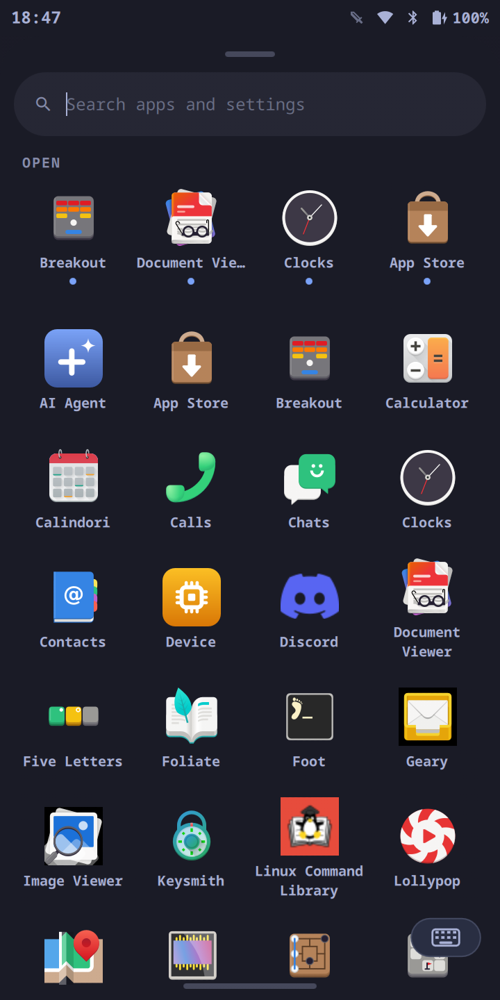

# moarchy

<p align="center">
  
  
  
  
  
  
</p>

Omarchy's look, keybindings and theming on a phone — a **Google Pixel 3a** —
running on Arch Linux ARM with **Sway** in Hyprland's place.

This is not a fork of Omarchy's installer. It is a thin overlay that vendors
Omarchy's *configuration and theme layer* — which is architecture-neutral — onto
an aarch64 base, and replaces the one part that cannot work on this hardware.

## Install

Download the image for your phone from
**[Releases](https://github.com/SimonSchubert/moarchy/releases)**. There is no
installer to run on the device and no default password to change: the account's
password is locked and tty1 autologin brings the session up without one.

The bootloader must be unlocked. Unpack the sargo archive, put the phone in
fastboot (power off, hold Volume Down, tap Power), and run `flash.sh`. That
overwrites `boot` and `userdata`; the Android install does not survive it.

```bash
tar -xJf moarchy-sargo-*.tar.xz
cd moarchy-sargo-*
./flash.sh
```

## Why not just run Omarchy?

Two hard blockers, both verified rather than assumed.

**1. Omarchy's package repo is x86_64-only.**

```
https://pkgs.omarchy.org/stable/x86_64/omarchy.db  ->  200  (211 packages)
https://pkgs.omarchy.org/stable/aarch64/omarchy.db ->  404
```

`install/preflight/guard.sh` upstream also requires x86_64, limine, a btrfs root
and vanilla-Arch markers — none of which hold on a phone.

**2. There is no packaged device stack.** No pacman repo anywhere carries an
SDM670 kernel or the Pixel 3a's firmware, so moarchy builds and publishes both,
at pins ([`docs/devices.md`](docs/devices.md) §2).

## What ports cleanly, and why

Omarchy 4.x generates its per-app theming from one small file per theme,
`colors.toml`, expanded through `default/themed/*.tpl` by
`omarchy-theme-set-templates`. The Hyprland template (`hyprland.lua.tpl`) is
**18 lines** — it sets window and group border colours and nothing else.

So the entire theme system ports by adding **one file**:
[`default/themed/sway.conf.tpl`](default/themed/sway.conf.tpl). All **22**
upstream themes then work on Sway with no per-theme effort, and
`shell.toml.tpl` — which themes the whole quickshell shell — along with
`foot.ini.tpl` and `btop.theme.tpl`, are reused untouched. (`alacritty.toml.tpl`
is reused untouched too, and has been unused here since the phone went down to
one terminal on 2026-09-08 — see [docs/apps.md](docs/apps.md).)

Better still, that template engine already processes a *user* template directory
(`~/.config/omarchy/themed`) ahead of its own built-ins — so moarchy adds
Sway theming **without patching the vendored upstream at all**.

## What runs on it

[`docs/apps.md`](docs/apps.md) — every app the phone ships with, what each one
is, and screenshots straight off the device for the ones that have been run on
it. Short version: GNOME's
libadwaita apps and KDE's Kirigami/Plasma Mobile apps both reflow to a 360px
screen and are the comfortable fit; availability is not the constraint, screen
width is.

## What it looks like

[`docs/style.md`](docs/style.md) is the style contract — the type scale, the six
colour roles, the four radii, the 44px touch-target floor and the motion
budget. It binds the shell plugins in this repo *and*
the two surfaces that are not in it: the
[keyboard](https://github.com/SimonSchubert/moarchy-keyboard) and the
[store](https://github.com/SimonSchubert/moarchy-store). Three programs, three
toolkits — quickshell/QML, standalone Qt, Python and GTK4 — one palette, read
from the theme `omarchy-theme-set` stages at
`~/.local/state/omarchy/current/theme/`.

`scripts/style-check.sh` enforces the half of it that is visible in the source.

## How this was built

[`docs/build-log.md`](docs/build-log.md) is the chronological account — every
measurement, and every dead end, including the ones that cost the most time
(RNDIS vs macOS, a write-protected SD adapter, Docker Desktop's missing Landlock,
and an assumption about Omarchy 4.x that turned out to be wrong twice over).

## Omarchy 4.x

moarchy runs **Omarchy v4.0.4** (`c668141`), pinned in
[`manifest.toml`](manifest.toml). There is no waybar, walker, mako or swayosd
in the package set: in 4.x the bar, launcher, notifications and OSD are one
**quickshell/QML** shell, and the phone UI is a set of plugins on top of it
rather than a patched copy of it.

An earlier port targeted v3.8.4 (`8fcc9d6`) — waybar, walker, mako and swayosd
— on the reading that v4.0.0 had moved to **herdr**, a bespoke shell shipped
only as an x86_64 binary. That reading was wrong twice over: herdr is neither
the shell nor closed source.
[`docs/omarchy-4x-feasibility.md`](docs/omarchy-4x-feasibility.md) is the
correction. The 3.8.4 port is gone; it exists only in git history.

**Why 4.x is portable.** The shell is quickshell/QML —
architecture-neutral, and `quickshell` builds for aarch64. What is left is
Hyprland coupling in five QML files, and `pkgbuilds/omarchy-config/port-4x.patch`
translates those
mechanically: `Quickshell.Hyprland` becomes `Quickshell.I3`, which speaks Sway's
IPC. The one genuine gap is `HyprlandFocusGrab`, which has no I3 counterpart, so
vendored popups lose click-outside-to-dismiss.

## Touch gestures

Sway's `bindgesture` only fires for touchpads, so the gestures are a Quickshell
plugin that owns the bottom edge as a layer surface and reads the touch itself.
Everything follows the finger rather than firing at a threshold.

One drag up from the home pill has two stops, the way Android's does:

```
0 -------------- 50% -------------- 100% -- past the top
    closes             opens                   HOME
```

| Gesture | What it does |
| --- | --- |
| Swipe up from the pill, short | The app drawer |
| Swipe up from the pill, further | Home — a workspace with nothing on it |
| Swipe up **on the wallpaper** | The app drawer, tracking the finger 1:1 |
| Press and hold the pill | The default coding agent, in a terminal — the picker, with none chosen yet |
| Swipe left / right | Next / previous workspace, which is next / previous app |
| Swipe in from the **right edge** | The overview — every workspace as a card, one under the other |
| Tap an app on a card | Switch to that app |
| Drag an app off its card | Move it to another workspace — two on one workspace tile, one above the other — or into the bin to close it |
| Pull down from the status bar | The shade: quick settings, brightness, media |

Every up-swipe raises the drawer — over an app, over a home screen, over
nothing (`docs/gestures.md` A5). The drawer is a launcher and nothing else:
what is already running is the overview's subject, and one surface answers
"where is everything" rather than two that show the same windows in two shapes.
Nothing on the strip closes a window either: apps are closed by dragging them
into the overview's bin, one at a time (C4, P12).

The two vertical edges are one gesture each, and the right one is the map. A
swipe in from it pulls the **overview** across: every workspace as a card, one
under the other, each showing the windows on it. Tap a card to go there, tap an
app to go straight to it, or **drag an app onto another card** to move it —
which is the one way a workspace comes to hold two. Drag it into the bin at the
foot of the sheet and it closes, which is the one place a window is closed by
hand.

Two windows side by side on a 360px screen get 180px each, which nothing here
can use — so a workspace that holds more than one is **split vertically**, one
above the other, at 370px each. `bin/moarchy-one-app-per-workspace` does that on
sway's own event stream, so a keyboard user's `$mod+Shift+2` lands the same way
as the drag. Launching an app still gives it a workspace of its own — sharing one
is something you ask for, once, by dragging.

The hold is the other gesture Android spends on what its owner reaches for
most. Here that is the coding agent, and the pill **shakes** while the press
counts down — a 4px line under a motionless thumb otherwise looks exactly like
a 4px line under a thumb that is only resting, and a gesture nobody can see
happening is a gesture nobody finds (C1, C2).

Everything is reachable without a finger, which is how the selftest asserts it:

```bash
omarchy-shell overview windows      # one line per open window
omarchy-shell gestures swipe home
moarchy-selftest --gestures   # drives real synthetic touch via /dev/uinput
```

## Layout

Ten files worth knowing about. For the whole map — the eleven shell plugins and
what each owns, how the screens stack, where a given change goes, and what to run
— see **[docs/README.md § The code](docs/README.md#the-code)**.

| Path | What it is |
| --- | --- |
| `default/omarchy/plugins/` | The phone UI: thirteen quickshell plugins and the shared code under `moarchy.common/` |
| `manifest.toml` | The version pins. The only file that says what version of anything is built |
| `pkgbuilds/` | `moarchy`, `omarchy-config` (upstream + the Sway port as a patch), `moarchy-meta`, `moarchy-keyring` |
| `pkgbuilds/moarchy-meta/PKGBUILD` | The aarch64 package set, as `depends`, with every omission explained |
| `default/sway/bindings.conf` | Omarchy's bindings, translated to Sway, key-for-key |
| `pkgbuilds/moarchy-device-sargo/sway.conf` | 1080×2220 @ scale 3, touch, no gaps, the power key |
| `default/themed/sway.conf.tpl` | The one file that themes Sway from any Omarchy theme |
| `bin/moarchy-*` | Sway counterparts to Omarchy's Hyprland helpers |
| `bin/omarchy-*` | Shims with upstream's names, so `omarchy-menu` keeps working |
| `docker/` | aarch64 container that builds every package natively on Apple Silicon |
| `image/boot/android-bootimg.sh` | The boot backend: mkbootimg, AVB, the sparse rootfs |

## Updating

The image ships the `[moarchy]` repository, so everything updates with one
command — the kernel, firmware and modem stack from `[moarchy]` itself,
and the phone UI from moarchy:

```bash
sudo pacman -Syu
```

The database and every package are signed, and `pacman.conf` says
`SigLevel = Required`, so an unsigned or altered package is refused rather than
installed as root.

Shell files land immediately but the running shell keeps the old code until it
restarts — a pacman hook says so after an upgrade:

```bash
moarchy-restart-shell     # or reboot
```

<sub>Adding the repo to a phone that predates it, or to a stock DanctNIX
install, needs the key first — `moarchy-keyring` is itself signed, so pacman
will not install it without already trusting the key:</sub>

```bash
S=https://github.com/SimonSchubert/moarchy/releases/download/repo
curl -fsSLO $S/moarchy.asc
sudo pacman-key --init
sudo pacman-key --add moarchy.asc
sudo pacman-key --lsign-key 3CA83612E7F3108F442006B418305B893569BAD3
printf '\n[moarchy]\nSigLevel = Required\nServer = %s\n' "$S" | sudo tee -a /etc/pacman.conf
sudo pacman -Syu moarchy-meta
```

Reflashing is still needed for changes to the partition layout, to what runs on
first boot, or to the u-boot SPL — that lives outside any partition, at byte
131072.

## Building it yourself

```bash
./scripts/provision.sh build      # the packages, in an aarch64 container
./scripts/build-image.sh          # -> images/moarchy-sargo-<version>-<date>/
./scripts/verify-image.sh         # 93 checks against the image just built
```

Everything comes from the commits pinned in `manifest.toml`, so two runs a
month apart produce the same image. The package build produces the
components (`moarchy-keyboard`, `moarchy-store-git`, `moarchy-keep`,
`moarchy-vitals`), the AUR rebuilds (`yay`, `xdg-terminal-exec`,
`ttf-ia-writer`, `cbonsai`, `lcl-gui-bin`, `mise-bin`), and `pkgbuilds/`
(`moarchy`, `omarchy-config`, `moarchy-meta`, `moarchy-qml-apps`,
`moarchy-keyring`, and a `moarchy-device-*` per phone).

For a debug image that joins your wifi on first boot and enables sshd:

```bash
WIFI_SSID='MyNetwork' WIFI_PSK='secret' \
  MOARCHY_SSH_KEY=~/.ssh/id_ed25519.pub ./scripts/build-image.sh
```

Both are optional and both mark the image as a debug build. `MOARCHY_SSH_KEY`
authorises that key for the phone's account and enables `sshd`, which saves the
round trip through the card that a reflash otherwise costs — the account has no
password, so there is no other way back in.

Do not publish either. The PSK is a secret; the key is not, but an
`authorized_keys` in a public image would have every phone that flashes it trust
one person's key. `./scripts/verify-image.sh` fails an image carrying either.

### Getting back in after a reflash

A reflash wipes `/home/moarchy/.ssh`, and the account has no password, so a
published image locks you out of your own phone until a key is authorised
again. Rather than pulling the SD card, type one line on the phone:

```bash
curl -sL https://raw.githubusercontent.com/SimonSchubert/moarchy/main/scripts/authorize-ssh.sh | sh -s <github-user>
```

That authorises every public key on `https://github.com/<github-user>.keys`,
enables `sshd`, and prints the phone's address and host-key fingerprint. The
username is required and has no default, for the same reason a published image
carries no `authorized_keys`.

### Developing against a phone you already have

```bash
./scripts/provision.sh build
./scripts/provision.sh deploy     # scp the packages over
./scripts/provision.sh install    # one pacman transaction
```

## What you get, and what you don't

Kept: Omarchy's keybindings, all 22 themes with live switching, the whole
quickshell shell — bar, launcher, notifications, OSD — the `omarchy-menu`
system, and the themed terminal/btop/fastfetch/starship stack.

Gone, because they are Hyprland renderer features that a GLES 2.0 device could
never have driven: blur, shadows, rounded corners, animations, gradient borders,
`hyprlock` (replaced with a themed `swaylock`).

Also dropped: universal copy/paste (Hyprland `sendshortcut` has no Sway
equivalent), OCR capture (`tesseract` has no aarch64 build), dictation
(`voxtype` is x86-only), and every x86-only proprietary app — 1Password, Spotify,
Obsidian, Typora. See the bottom of `pkgbuilds/moarchy-meta/PKGBUILD` for the
full list with reasons.

## Measured on the device

Numbers from a real Pixel 3a (SDM670, 4 GB), not estimates:

| | |
| --- | --- |
| GPU | Adreno 615 on freedreno — GLES 3.2 and Vulkan |
| Panel | 1080x2220, `scale 3` -> 360x740 logical |
| Storage | rootfs in `userdata`, grown on first boot |
| btop minimum | 60 columns, regardless of `shown_boxes` |

That last row is why `moarchy-launch-tui` drops TUIs to font size 7 (~60
columns): at Omarchy's desktop font size, btop simply refuses to draw on this
screen. The window is a normal tiled one — the bar and the keyboard anchor to
opposite edges, so neither costs a column, and a fullscreened terminal would
only hide the keyboard.

Wi-Fi, Bluetooth, sound, camera, vibration, NFC, calls with voice on them and
SMS in both directions are all measured on the handset rather than reported;
[`docs/devices.md`](docs/devices.md) D27–D34 is the evidence.

## Known limitations

- **Telephony has only been tried on an operator with circuit-switched
  fallback.** A VoLTE-only network needs an IMS stack that is not here yet —
  [`docs/devices.md`](docs/devices.md) §10.
- **The camera's colour profile is matrix-only** — no HueSatMap and no look
  table, so colour is correct rather than pleasing.

## Out of scope for now

Video recording (Megapixels' path wants GStreamer plugins nothing declares),
power tuning beyond the idle/blank path, and rotation *sensor* handling — the
shade's Rotate tile is manual.

The camera, telephony, suspend, the package repository and the on-screen
keyboard were all on this list and are not any more. The camera entry here read
"`VIDIOC_STREAMON` fails on both sensors" until 2026-09-06, and that was never
the problem: nothing was configuring the media graph, which is what
`libmegapixels` does. See [`docs/apps.md`](docs/apps.md).
