# Apps that work on the PinePhone

Every app below was installed and launched on a **Pine64 PinePhone Braveheart
(1.1)** — Allwinner A64, 2 GB RAM, 720×1440 at `scale 2` (360×720 logical) —
running this Sway session. Screenshots are straight off the device via `grim`,
uncropped, so the bar is visible in each one.

## What actually limits app choice

Availability is *not* the constraint. Essentially the whole desktop catalogue is
built for aarch64 in Arch Linux ARM — Firefox, Chromium, GIMP, Inkscape,
LibreOffice, Signal, Telegram all install fine. Three other things decide whether
an app is usable:

1. **A 360×720 logical screen.** Desktop layouts do not reflow. The apps that
   work are the ones designed to adapt — GNOME's libadwaita apps and KDE's
   Kirigami/Plasma Mobile apps. Both families were built for phones.
2. **2 GB of RAM.** Electron and Chromium will run and will hurt.
3. **`*-bin` AUR packages are usually dead.** They ship prebuilt x86_64 binaries
   by definition. `braincup-bin`, for example, ships
   `Braincup-3.5.0-linux-x86_64.tar.gz` and has no source PKGBUILD — there is
   nothing to rebuild for ARM, and `dotnet-runtime` is not in the aarch64 repos
   either. Check for a non-`-bin` package before assuming an app is available.

## GNOME (libadwaita)

These reflow to a phone width natively and are the most comfortable fit.

| App | Package | Notes |
| --- | --- | --- |
| Clocks | `gnome-clocks 50.0-2` | Bottom tab bar, fully adaptive |
| Text Editor | `gnome-text-editor 50.1-1` | Works well with the on-screen keyboard |
| Loupe | `loupe 50.0-1` | Image viewer, gesture zoom |
| Papers | `papers 50.2-1` | PDF viewer (Evince's successor) |
| Foliate | `foliate 3.3.0-3` | E-book reader; genuinely good on this screen |
| Portfolio | `portfolio-file-manager 1.0.2-1` | File manager built for touch |

<p align="center">
  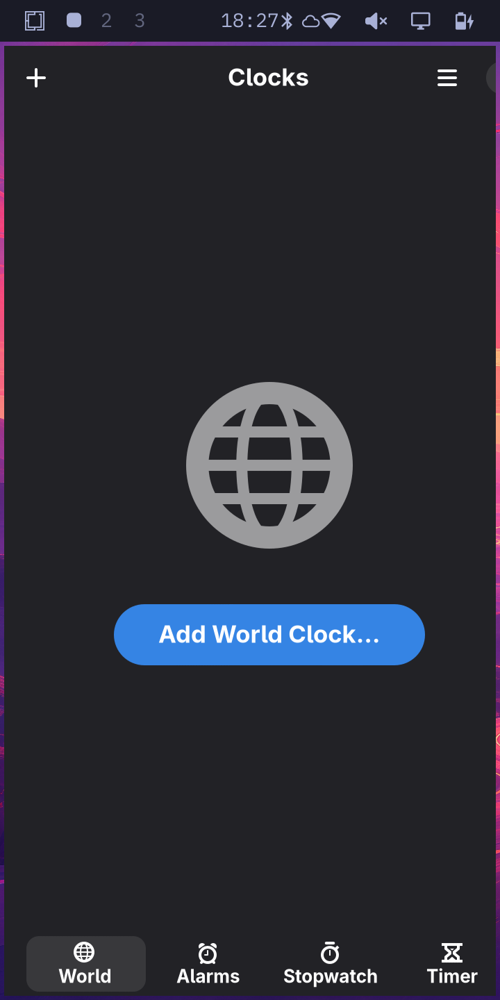
  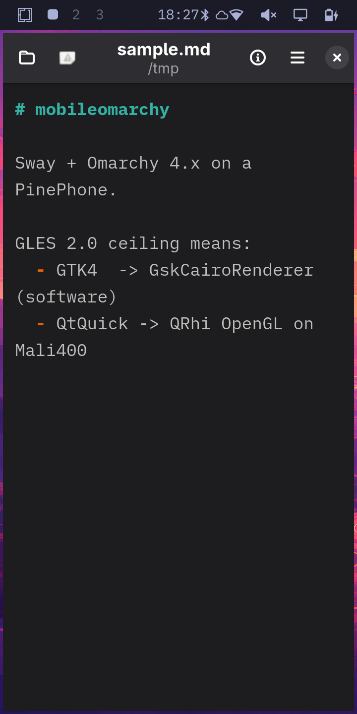
  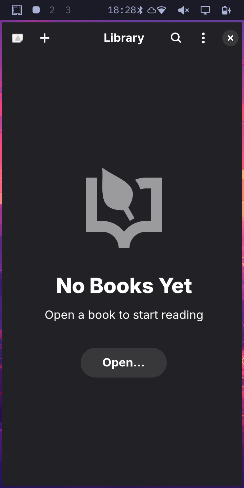
</p>
<p align="center">
  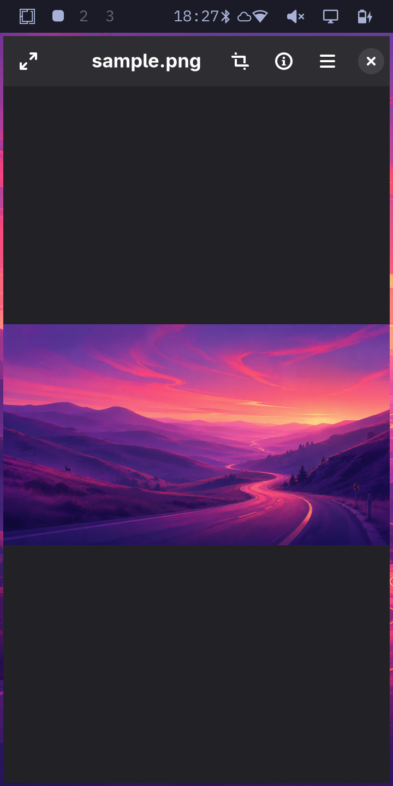
  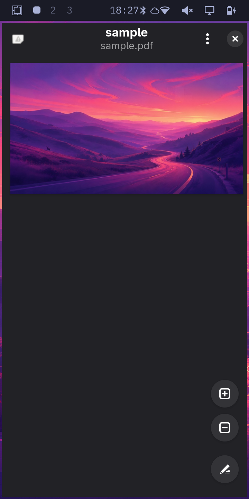
  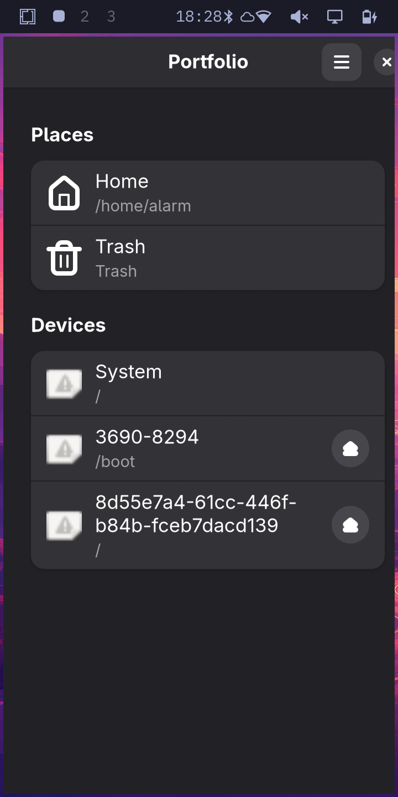
</p>

```bash
sudo pacman -S gnome-clocks gnome-text-editor loupe papers foliate portfolio-file-manager
```

## Plasma Mobile (Kirigami)

KDE's mobile apps are the other family designed for this form factor, and they
run without a KDE session — they are ordinary Wayland clients under Sway.

| App | Package | Notes |
| --- | --- | --- |
| Kalk | `kalk 26.08.0-1` | Calculator with unit conversion |
| KClock | `kclock 26.08.0-1` | Clock, alarms, timers |
| KWeather | `kweather 26.08.0-1` | Weather |
| Keysmith | `keysmith 26.08.0-1` | TOTP / 2FA codes |
| Calindori | `calindori 26.08.0-1` | Calendar |
| QMLKonsole | `qmlkonsole 26.08.0-1` | Touch-friendly terminal |
| Index | `index-fm 4.0.2-2` | File manager |

<p align="center">
  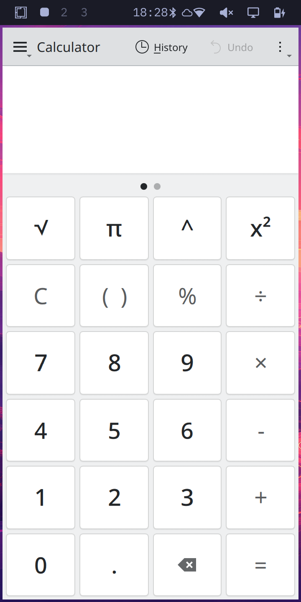
  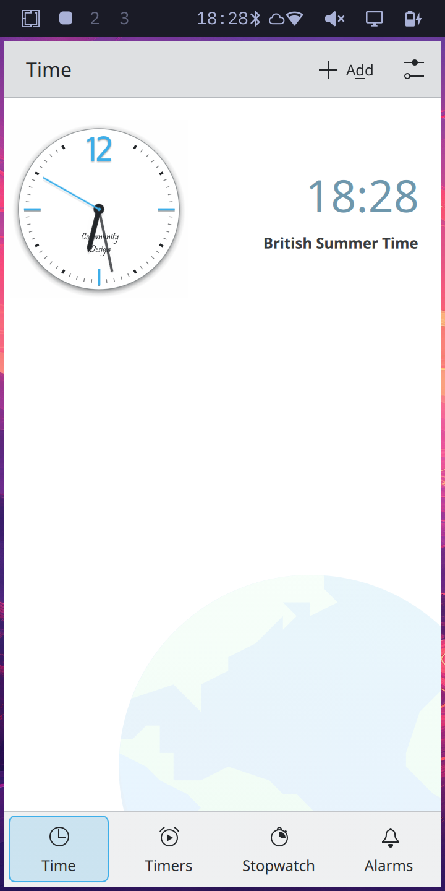
  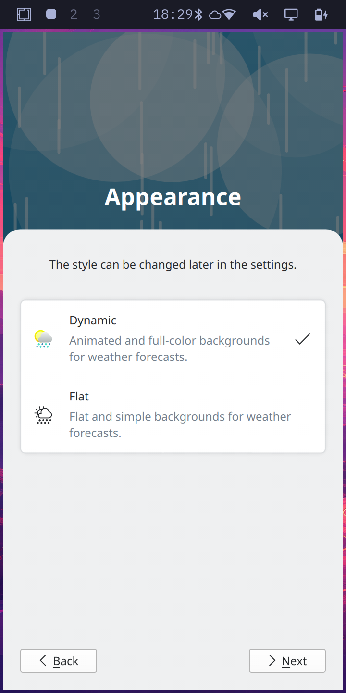
</p>
<p align="center">
  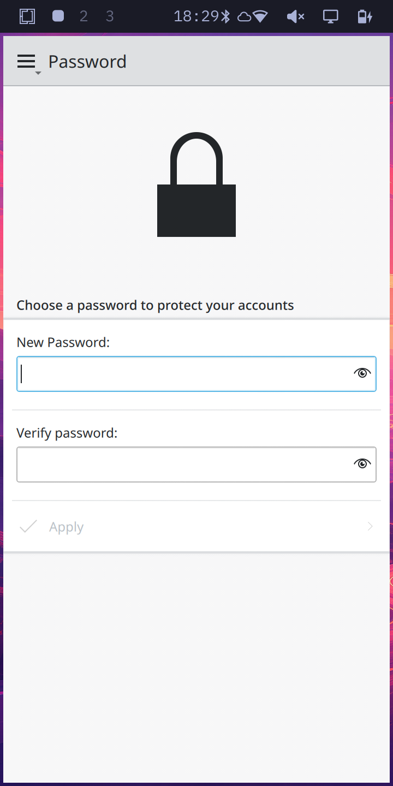
  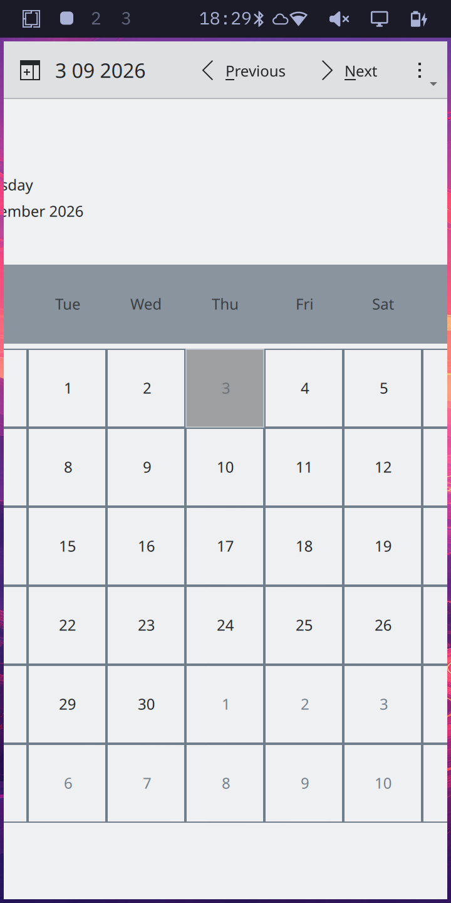
  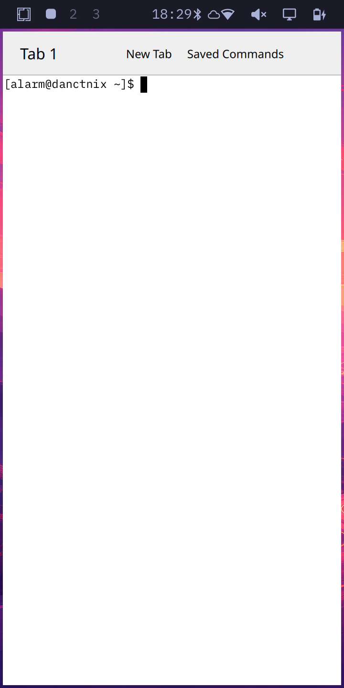
</p>
<p align="center">
  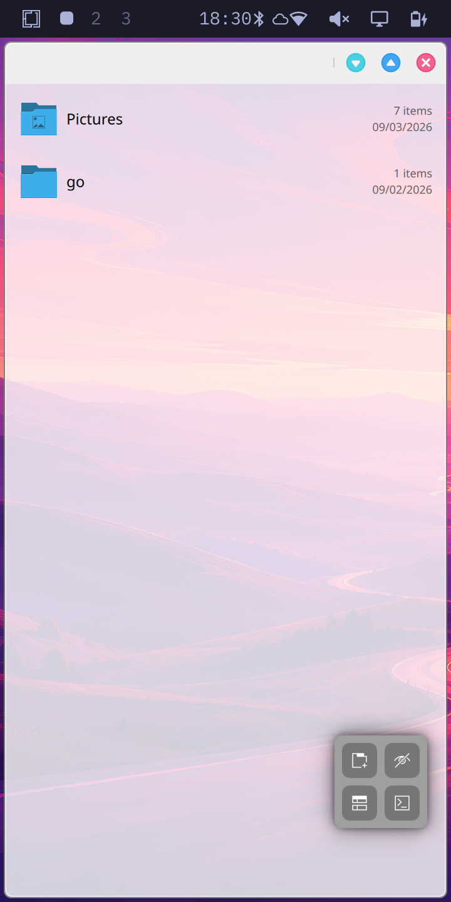
</p>

```bash
sudo pacman -S kalk kclock kweather keysmith calindori qmlkonsole index-fm
```

## Terminal apps

This is where the hardware is genuinely comfortable, and it is the Omarchy idiom
anyway. Two measured constraints shape it:

- A **fullscreen terminal is 47×41 characters** at font size 9.
- **btop refuses to draw below 60 columns**, whatever `shown_boxes` says.

So `mobileomarchy-launch-tui` opens TUIs fullscreen at font size 7. For something
that fits a *tiled* terminal with the bar still visible, use **`btm`** (bottom) —
it adapts, and shows CPU, memory, all three thermal zones, disks and network.

Also installed and worth knowing: `htop`, `lazygit`, `nmtui-connect` (wifi),
`bluetui`, `wiremix` (audio), `s-tui` (CPU frequency/temperature graphs).

`impala` is installed too and looks like the wifi TUI to reach for, but it is an
**iwd** client and this phone runs NetworkManager with `iwd.service` disabled —
iwd is D-Bus activatable, so impala starts it to fight NetworkManager for
`wlan0` rather than failing cleanly. `nmtui-connect` is the one both the shade
and Settings open.

## Browsers

**Epiphany** (`epiphany`) is the one to reach for — WebKit, ~260 MB, and it has a
genuinely adaptive mobile layout with the URL bar at the bottom. Firefox and
Chromium both install and run, but cost far more memory for no layout benefit.

Heavy SPAs are the real problem, not the browser. x.com loads but paints poorly
and leaves large black regions — that is the workload against a 1.15 GHz A53 and
a GLES 2.0 GPU, not something configuration fixes.

## Not working

| | |
| --- | --- |
| **Microphone** | Records digital silence (RMS 0) at PipeWire *and* raw ALSA, despite `Mic1` on, boost 7, `ADC` 144/192 and `AIF1 Slot 0 Digital ADC` enabled |
| **Camera** | `ov5640` (rear) and `gc2145` (front) both register in the media graph, but `VIDIOC_STREAMON` fails — pipeline links unconfigured. `megapixels` installs but did not produce a window |
| Audio **output** | Works |
| Hardware video decode | `cedrus` present at `/dev/video1`, unexplored |

See [`build-log.md`](build-log.md) for how the device was set up and what else is
known-broken.
