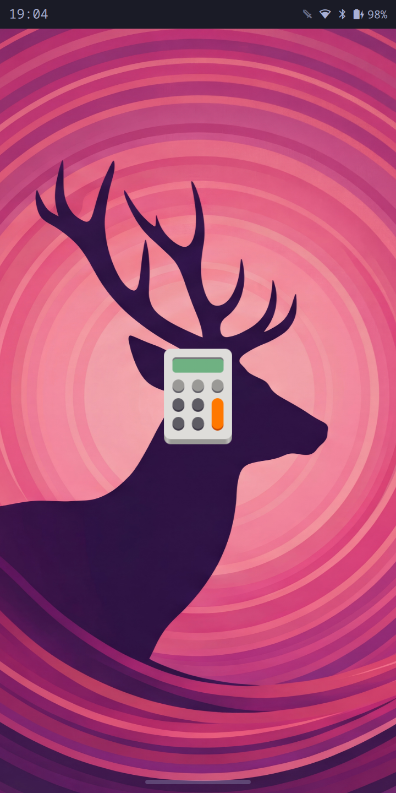

# Windows — specification

What an app gets when it opens: the whole workspace, and its own icon on the
wallpaper while it is on its way there. Present tense, normative. The
archaeology lives in [build-log.md](build-log.md).

Ids are `W<n>` for the window area and `L<n>` for the launch splash, cited by
any check that proves one. Lines marked **?** are my reading of the code rather
than your decision — read those first.

Not here: how the bar and the gesture strip take their bands off the screen.
Those are exclusive zones, they are already subtracted from the workspace rect
before any of this applies, and they belong to [gestures.md](gestures.md).

---

## W1–W4. The window area

**W1** A single app on a workspace fills its workspace exactly. No wallpaper
shows around it, on any edge.
→ `swaymsg -t get_tree` reports the focused window's `rect` equal to the focused
workspace's `rect`

**W2** That is `gaps inner 0` doing it, not the border. Sway applies inner gaps
at the workspace edge as well as between windows, so `gaps inner 3` cost 6px of
a 360px width and 6px of a ~660px height on every app.
→ `default/sway/pinephone.conf` sets `gaps inner 0` and `gaps outer 0`

Worth knowing before you go looking for a bug: **`swaymsg reload` does not apply
a changed `gaps` to workspaces that already exist.** The config value is what a
workspace is *created* with. A session that predates this change keeps its old
gaps through any number of reloads and needs `swaymsg gaps inner all set 0`, or
a fresh session, to catch up.

**W3** The 2px border stays and costs nothing in the normal case: `looknfeel.conf`'s
`hide_edge_borders smart` drops every border of the only visible window on a
workspace, and `moarchy-one-app-per-workspace` makes that the normal case.
Split a workspace and the borders come back — they are then the only thing
saying which pane has focus.
→ W1 holds with one window; with two, each window's `rect` is inset by the
border and the two are adjacent

**W4** `moarchy-window-gaps-toggle` adds gaps and takes them away again.
Inverted from the desktop original, whose first press *removed* gaps: with the
default now none, that press did nothing at all and the second one added
padding to a phone.
→ one press narrows the workspace to `output width - 6` at `x=3`; a second
restores it to the full width at `x=0`. Width, not the window rect: the window
rect carries every exclusive zone on the screen, so the keyboard coming up
mid-check reads as a gaps failure.

---

## L1–L8. The launch splash

Replaces upstream's launch OSD — a rounded panel reading "Launching Files…"
with a rocket glyph, shown two seconds after the tap. Two things were wrong
with it here: two seconds is most of a PinePhone app launch, so the feedback
arrived after the moment it was for, and a panel of chrome is not what a phone
shows while an app opens.

**L1** Tapping an app in the drawer puts that app's own icon on screen,
centred, as the drawer closes. Not two seconds later.
→ `omarchy-shell splash state` reads `open` within a second of the launch

**L2a** The splash is on the Overlay layer, not Top. Sway renders a fullscreen
view above the top layer, so on Top the splash disappeared behind any
fullscreen window — and `pinephone.conf` fullscreens every TUI.
→ `omarchy-shell splash geometry` reports `layer=overlay`, read back off the
window rather than restated

**L2** Nothing is drawn but the icon. The background is transparent and the
wallpaper — or whatever was on the workspace — is what is behind it.
→ the splash surface is sized to the icon, not to the screen:
`omarchy-shell splash geometry` reports a width under half the screen's

**L3** The splash catches no input worth the name. The home pill, the back
edge and the status bar all keep working while it is up.
→ the surface is its own input region (L2) *and* its mask is one pixel, so this
holds twice over. One pixel rather than none: an empty mask reads as "no input"
and means the opposite — Qt treats an empty mask as unset, and an unset input
region is the whole surface. moarchy-keyboard's `src/panel.cpp` carries the
same workaround for the same reason.

**L4** It goes when the app's window appears, with a short fade so the app is
not revealed by a jump cut.
→ `omarchy-shell splash state` reads `closed` once the window has mapped

**L5** A `.desktop` entry that summons a shell plugin rather than starting a
process — `moarchy.device` is one — never produces a window. The splash
goes when that plugin's surface opens instead.
→ launching Device leaves `omarchy-shell splash state` at `closed`

**L6** If nothing ever appears, the splash gives up after 15 seconds rather
than sitting on the wallpaper. That is upstream's timeout, kept.
→ `omarchy-shell splash state` reads `closed` 16s after launching a command
that exits immediately

**L7** An app whose icon resolves to nothing still gets a splash: a rounded
outline in the theme's foreground, not a blank screen. The generic
`application-x-executable` is not the fallback, because on this image it is not
reachable — it exists only inside AdwaitaLegacy's `mimetypes/`, which the active
theme does not inherit, so Qt's themed lookup returns "" and so does upstream's
`iconSource("")`.
→ `omarchy-shell splash drawn` reports `icon <path>` or `fallback`, never
`nothing`

**L8** The icon pulses, slowly, while it is up. **?** A static icon on the
wallpaper reads as a stuck frame on hardware this slow; the pulse is what says
the launch is still running. It is one transform on one textured quad, which is
what the Mali-400 can afford.

  

### What the splash does not cover

Apps started from a terminal, from a keybinding, or by
`moarchy-launch-terminal` and friends. The splash hangs off
`AppLibrary.launch()`, which is the drawer's and the Omarchy menu's path and
nothing else's.
